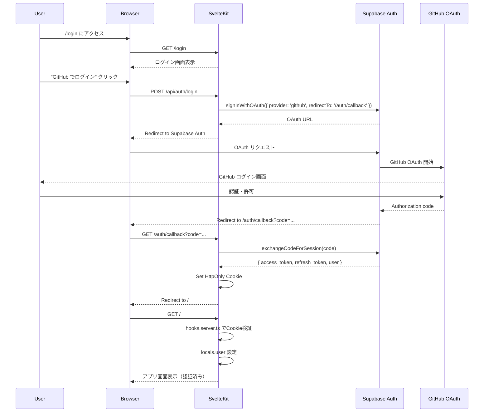
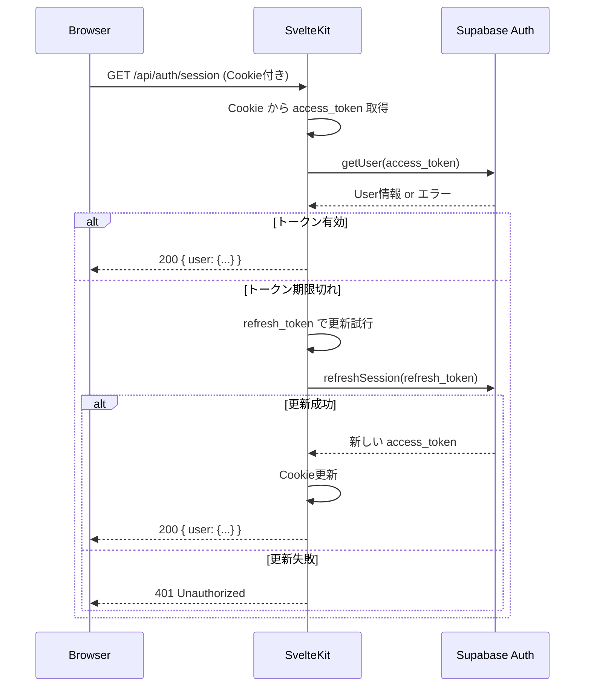
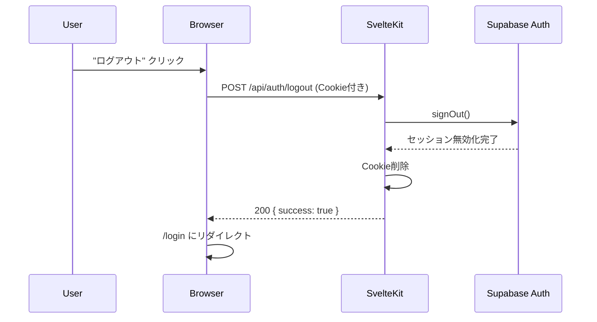

# Supabase Auth 実装ガイド

本番環境で使用する Supabase Auth (GitHub OAuth) の実装方針とセットアップ手順。

---

## 概要

### アーキテクチャ

- **認証プロバイダー**: Supabase Auth (GitHub OAuth)
- **セッション保持**: HttpOnly Cookie
- **トークン管理**: サーバーサイドのみ（CSRでBearerトークンを保持しない）
- **認証ガード**: `hooks.server.ts` で `locals.user` を設定

### セキュリティ方針

- ✅ HttpOnly Cookie でトークンを保護（XSS 対策）
- ✅ SameSite=Lax で CSRF 対策
- ✅ Secure=true（本番環境）でHTTPS強制
- ✅ サーバーサイドでJWT検証
- ✅ トークン自動更新（refresh_token 使用）

---

## セットアップ手順

### 1. Supabase プロジェクト作成

1. [Supabase Dashboard](https://app.supabase.com/) にログイン
2. 新規プロジェクトを作成
   - Project name: `susumon`（任意）
   - Database Password: 強力なパスワードを生成
   - Region: `Northeast Asia (Tokyo)` 推奨

3. プロジェクト作成後、以下の情報を取得:
   - Project URL: `https://YOUR_PROJECT_ID.supabase.co`
   - Anon (public) key
   - Service role key（秘密鍵、サーバー専用）

### 2. GitHub OAuth アプリ作成

1. GitHub → [Settings](https://github.com/settings/profile) → Developer settings → [OAuth Apps](https://github.com/settings/developers)
2. "New OAuth App" をクリック
3. 以下を入力:
   - **Application name**: `Susumon (Dev)`
   - **Homepage URL**: `http://localhost:5173`（開発環境）
   - **Authorization callback URL**: `https://YOUR_PROJECT_ID.supabase.co/auth/v1/callback`
4. "Register application" をクリック
5. Client ID と Client Secret を取得（Secret は一度しか表示されないので注意）

### 3. Supabase に GitHub OAuth を設定

1. Supabase Dashboard → Authentication → Providers
2. GitHub を有効化
3. GitHub Client ID と Client Secret を入力
4. "Enabled" をONにして保存

### 4. 環境変数を設定

#### ローカル開発（`.env`）

```env
# モック認証を無効化
USE_MOCK_AUTH="false"
NODE_ENV="development"

# Supabase 設定
SUPABASE_URL="https://YOUR_PROJECT_ID.supabase.co"
SUPABASE_ANON_KEY="your-anon-public-key-here"
SUPABASE_SERVICE_ROLE_KEY="your-service-role-secret-key-here"

# Cookie 設定（開発環境）
AUTH_COOKIE_NAME="sb-auth-token"
AUTH_COOKIE_SECURE="false"  # ローカルはHTTPなのでfalse
```

#### 本番環境（Deno Deploy）

Deno Deploy ダッシュボードの Environment Variables に設定:

```env
USE_MOCK_AUTH="false"
NODE_ENV="production"

SUPABASE_URL="https://YOUR_PROJECT_ID.supabase.co"
SUPABASE_ANON_KEY="your-anon-public-key-here"
SUPABASE_SERVICE_ROLE_KEY="your-service-role-secret-key-here"

# Cookie 設定（本番環境）
AUTH_COOKIE_NAME="sb-auth-token"
AUTH_COOKIE_SECURE="true"  # HTTPSを強制
```

---

## 認証フロー

### ログインフロー



### セッション確認フロー



### ログアウトフロー



---

## Cookie 管理

### Cookie 仕様

| 項目 | 開発環境 | 本番環境 |
|------|----------|----------|
| Cookie名 | `sb-auth-token` | `sb-auth-token` |
| HttpOnly | `true` | `true` |
| Secure | `false` | `true` |
| SameSite | `Lax` | `Lax` |
| Path | `/` | `/` |
| Max-Age | `3600` (1時間) | `3600` (1時間) |

### Cookie の内容

```json
{
  "access_token": "eyJhbGciOiJIUzI1NiIsInR5cCI6IkpXVCJ9...",
  "refresh_token": "v1.MRjBRQv...",
  "expires_at": 1640995200,
  "user": {
    "id": "uuid-v4-here",
    "email": "user@example.com",
    "user_metadata": {
      "avatar_url": "https://avatars.githubusercontent.com/...",
      "user_name": "github-username"
    }
  }
}
```

### Cookie 操作ユーティリティ

実装場所: `src/lib/server/auth.ts`

```typescript
import { createClient } from '@supabase/supabase-js';
import type { Cookies } from '@sveltejs/kit';

const COOKIE_NAME = Deno.env.get('AUTH_COOKIE_NAME') || 'sb-auth-token';
const IS_SECURE = Deno.env.get('AUTH_COOKIE_SECURE') === 'true';

export function setAuthCookie(cookies: Cookies, session: Session) {
  cookies.set(COOKIE_NAME, JSON.stringify(session), {
    httpOnly: true,
    secure: IS_SECURE,
    sameSite: 'lax',
    path: '/',
    maxAge: 60 * 60, // 1時間
  });
}

export function getAuthCookie(cookies: Cookies): Session | null {
  const value = cookies.get(COOKIE_NAME);
  if (!value) return null;

  try {
    return JSON.parse(value);
  } catch {
    return null;
  }
}

export function deleteAuthCookie(cookies: Cookies) {
  cookies.delete(COOKIE_NAME, { path: '/' });
}
```

---

## トークン更新

### 更新タイミング

- **自動更新**: `hooks.server.ts` でリクエストごとにトークン有効期限をチェック
- **更新条件**: `expires_at` まで5分を切った場合
- **更新方法**: `refresh_token` を使って新しい `access_token` を取得

### 実装例

```typescript
// src/hooks.server.ts
import { refreshSession } from '$lib/server/auth';

export const handle: Handle = async ({ event, resolve }) => {
  const session = getAuthCookie(event.cookies);

  if (!session) {
    // 未認証
    return resolve(event);
  }

  // トークン有効期限チェック
  const expiresAt = session.expires_at * 1000; // ミリ秒に変換
  const now = Date.now();
  const fiveMinutes = 5 * 60 * 1000;

  if (expiresAt - now < fiveMinutes) {
    // 5分以内に期限切れ → refresh_token で更新
    const newSession = await refreshSession(session.refresh_token);

    if (newSession) {
      setAuthCookie(event.cookies, newSession);
      event.locals.user = newSession.user;
    } else {
      // 更新失敗 → Cookie削除
      deleteAuthCookie(event.cookies);
    }
  } else {
    // まだ有効
    event.locals.user = session.user;
  }

  return resolve(event);
};
```

---

## API エンドポイント実装

### `/api/auth/login`

GitHub OAuth ログインを開始。

```typescript
// src/routes/api/auth/login/+server.ts
import { redirect } from '@sveltejs/kit';
import { createClient } from '@supabase/supabase-js';
import type { RequestHandler } from './$types';

const supabase = createClient(
  Deno.env.get('SUPABASE_URL')!,
  Deno.env.get('SUPABASE_ANON_KEY')!
);

export const POST: RequestHandler = async ({ url }) => {
  const { data, error } = await supabase.auth.signInWithOAuth({
    provider: 'github',
    options: {
      redirectTo: `${url.origin}/auth/callback`,
    },
  });

  if (error) {
    return new Response(JSON.stringify({ error: error.message }), {
      status: 400,
      headers: { 'Content-Type': 'application/json' },
    });
  }

  throw redirect(303, data.url);
};
```

### `/auth/callback`

GitHub OAuth コールバックを処理。

```typescript
// src/routes/auth/callback/+server.ts
import { redirect } from '@sveltejs/kit';
import { createClient } from '@supabase/supabase-js';
import { setAuthCookie } from '$lib/server/auth';
import type { RequestHandler } from './$types';

const supabase = createClient(
  Deno.env.get('SUPABASE_URL')!,
  Deno.env.get('SUPABASE_ANON_KEY')!
);

export const GET: RequestHandler = async ({ url, cookies }) => {
  const code = url.searchParams.get('code');

  if (!code) {
    throw redirect(303, '/login?error=no_code');
  }

  const { data, error } = await supabase.auth.exchangeCodeForSession(code);

  if (error) {
    console.error('[Auth Callback] Error:', error);
    throw redirect(303, '/login?error=auth_failed');
  }

  // Cookie に保存
  setAuthCookie(cookies, data.session);

  // アプリのホーム画面へ
  throw redirect(303, '/');
};
```

### `/api/auth/session`

現在のセッション状態を返す。

```typescript
// src/routes/api/auth/session/+server.ts
import { json } from '@sveltejs/kit';
import type { RequestHandler } from './$types';

export const GET: RequestHandler = async ({ locals }) => {
  if (!locals.user) {
    return json({ user: null }, { status: 401 });
  }

  return json({
    user: {
      id: locals.user.id,
      email: locals.user.email,
      username: locals.user.user_metadata?.user_name || 'unknown',
    },
  });
};
```

### `/api/auth/logout`

ログアウト処理。

```typescript
// src/routes/api/auth/logout/+server.ts
import { json } from '@sveltejs/kit';
import { createClient } from '@supabase/supabase-js';
import { deleteAuthCookie, getAuthCookie } from '$lib/server/auth';
import type { RequestHandler } from './$types';

const supabase = createClient(
  Deno.env.get('SUPABASE_URL')!,
  Deno.env.get('SUPABASE_ANON_KEY')!
);

export const POST: RequestHandler = async ({ cookies }) => {
  const session = getAuthCookie(cookies);

  if (session?.access_token) {
    // Supabase 側でセッション無効化
    await supabase.auth.signOut();
  }

  // Cookie削除
  deleteAuthCookie(cookies);

  return json({ success: true });
};
```

---

## 認証ガード

### サーバーサイド（`hooks.server.ts`）

すべてのリクエストで `locals.user` を設定。

```typescript
// src/hooks.server.ts
import { type Handle } from '@sveltejs/kit';
import { isMockAuthEnabled, getMockUser } from '$lib/server/auth-mock';
import { getAuthCookie, setAuthCookie, deleteAuthCookie } from '$lib/server/auth';
import { createClient } from '@supabase/supabase-js';

// 本番環境でモック認証が有効になっていないかチェック
if (Deno.env.get('NODE_ENV') === 'production' && isMockAuthEnabled()) {
  throw new Error('FATAL: Mock auth cannot be used in production!');
}

const supabase = createClient(
  Deno.env.get('SUPABASE_URL')!,
  Deno.env.get('SUPABASE_ANON_KEY')!
);

export const handle: Handle = async ({ event, resolve }) => {
  // モック認証が有効な場合
  if (isMockAuthEnabled()) {
    event.locals.user = getMockUser();
    return resolve(event);
  }

  // Supabase Auth
  const session = getAuthCookie(event.cookies);

  if (!session) {
    // 未認証
    return resolve(event);
  }

  // トークン有効期限チェック & 自動更新
  const expiresAt = session.expires_at * 1000;
  const now = Date.now();
  const fiveMinutes = 5 * 60 * 1000;

  if (expiresAt - now < fiveMinutes) {
    // refresh_token で更新
    const { data, error } = await supabase.auth.refreshSession({
      refresh_token: session.refresh_token,
    });

    if (error || !data.session) {
      // 更新失敗 → Cookie削除
      deleteAuthCookie(event.cookies);
      return resolve(event);
    }

    // 新しいセッションでCookie更新
    setAuthCookie(event.cookies, data.session);
    event.locals.user = {
      id: data.user.id,
      email: data.user.email!,
      username: data.user.user_metadata?.user_name || 'unknown',
    };
  } else {
    // まだ有効
    event.locals.user = {
      id: session.user.id,
      email: session.user.email,
      username: session.user.user_metadata?.user_name || 'unknown',
    };
  }

  return resolve(event);
};
```

### クライアントサイド（UI）

ログイン状態を確認する場合は `/api/auth/session` を使用。

```svelte
<script lang="ts">
  import { onMount } from 'svelte';

  let user = $state<{ id: string; email: string; username: string } | null>(null);
  let loading = $state(true);

  onMount(async () => {
    try {
      const res = await fetch('/api/auth/session');
      if (res.ok) {
        const data = await res.json();
        user = data.user;
      }
    } catch (err) {
      console.error('Failed to fetch session:', err);
    } finally {
      loading = false;
    }
  });
</script>

{#if loading}
  <p>Loading...</p>
{:else if user}
  <p>Welcome, {user.username}!</p>
  <button onclick={async () => {
    await fetch('/api/auth/logout', { method: 'POST' });
    window.location.href = '/login';
  }}>
    Logout
  </button>
{:else}
  <a href="/login">Login</a>
{/if}
```

---

## エラーハンドリング

### よくあるエラー

| エラー | 原因 | 解決方法 |
|--------|------|----------|
| `Invalid login credentials` | GitHub OAuth の設定ミス | Supabase Dashboard で GitHub Provider を確認 |
| `redirect_uri_mismatch` | Callback URL が一致しない | GitHub OAuth App の Callback URL を `https://YOUR_PROJECT_ID.supabase.co/auth/v1/callback` に設定 |
| `Token expired` | `access_token` 期限切れ | `refresh_token` で自動更新（`hooks.server.ts` で実装済み） |
| `Invalid refresh token` | `refresh_token` 無効 | Cookie削除してログアウト → 再ログイン |

### デバッグ方法

```typescript
// src/hooks.server.ts にログ追加
console.log('[Auth] Session:', session);
console.log('[Auth] User:', event.locals.user);

// ブラウザの開発者ツール
// Application → Cookies → sb-auth-token を確認
```

---

## セキュリティチェックリスト

本番デプロイ前に以下を確認:

- [ ] `USE_MOCK_AUTH="false"` が設定されている
- [ ] `NODE_ENV="production"` が設定されている
- [ ] `AUTH_COOKIE_SECURE="true"` が設定されている
- [ ] `SUPABASE_SERVICE_ROLE_KEY` が環境変数に設定され、コードに埋め込まれていない
- [ ] GitHub OAuth App の Callback URL が本番環境のSupabase URLに設定されている
- [ ] Cookie の `HttpOnly`, `Secure`, `SameSite` 属性が正しく設定されている
- [ ] `/api/auth/*` 以外のAPIは `locals.user` で認証チェックしている

---

## トラブルシューティング

### 問題: ログイン後にCookieが設定されない

**原因**: Cookieの `Secure` 属性が `true` だが HTTPでアクセスしている

**解決**:
```env
# ローカル開発環境（.env）
AUTH_COOKIE_SECURE="false"
```

### 問題: トークンが自動更新されない

**原因**: `refresh_token` が無効 or `hooks.server.ts` の更新ロジックが動いていない

**解決**:
1. `hooks.server.ts` にログを追加して更新処理が実行されているか確認
2. Cookieの `refresh_token` が存在するか確認
3. Supabase Dashboard → Authentication → Users でセッションを確認

### 問題: 本番環境でモック認証が動作してしまう

**絶対に避けるべき状況**

**対策**:
```typescript
// src/hooks.server.ts
if (Deno.env.get('NODE_ENV') === 'production' && isMockAuthEnabled()) {
  throw new Error('FATAL: Mock auth cannot be used in production!');
}
```

---

## モック認証からの移行

### 手順

1. **Supabase プロジェクトを作成**（上記セットアップ手順を参照）
2. **`.env` を更新**
   ```env
   USE_MOCK_AUTH="false"
   SUPABASE_URL="https://YOUR_PROJECT_ID.supabase.co"
   SUPABASE_ANON_KEY="..."
   SUPABASE_SERVICE_ROLE_KEY="..."
   ```
3. **開発サーバーを再起動**
   ```bash
   deno task dev
   ```
4. **動作確認**
   - `/login` にアクセス
   - GitHub ログインが動作するか確認
   - `/api/auth/session` でユーザー情報が取得できるか確認

---

## まとめ

- ✅ Supabase Auth (GitHub OAuth) で安全な認証
- ✅ HttpOnly Cookie でトークンを保護
- ✅ サーバーサイドでトークン自動更新
- ✅ モック認証からシームレスに移行可能

Supabase Auth により、セキュアな認証システムを最小限のコードで実装できます。
