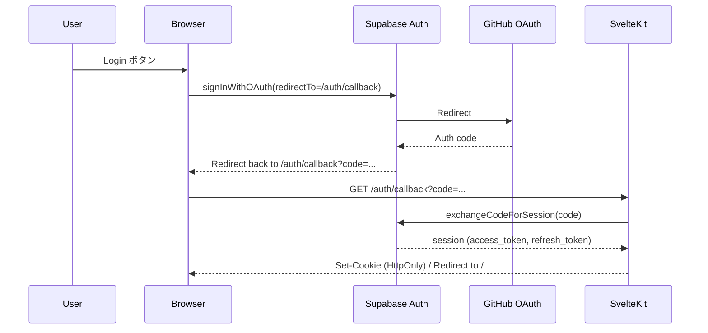

# Learning Log / Meta Note アプリ 技術仕様（Final v0.2）

本ドキュメントは、これまでの議論を基に **技術スタック／OpenAPI／デプロイ設計（Deno Deploy）／認証実装詳細（Supabase Auth + GitHub OAuth）** を v0.2 として確定する。

---

## 1. 技術スタック（確定）

- フロント/バックエンド：**SvelteKit（単一リポジトリ・Fullstack）**
  - UI ルーティング：`+page.svelte`
  - API ルーティング：`src/routes/api/**/+server.ts`
- 実行環境：**Deno Deploy**
- DB：**Deno Deploy Prisma Postgres**（PostgreSQL）
- ORM：**Prisma（Edge/Deno Deploy対応のデプロイガイドに従う）**
- 認証：**Supabase Auth（GitHub OAuth）**
- ID：
  - `user_id`：Supabase `auth.users.id`（uuid）
  - その他：UUIDv7（DB側生成 `uuid_v7()`）

---

## 2. OpenAPI（v0.2）

OpenAPI 定義は `docs/spec/learning_log_meta_note_アプリ_OpenAPI_v0.2.yaml` を正とする（本ドキュメント内の YAML は参考）。

### 2.1 共通ルール

- Base URL：`/api`
- 認証：HttpOnly Cookie（主）／Bearer JWT（任意）
- Content-Type：`application/json`
- 日付：JSTのローカル日付を `YYYY-MM-DD`（DBはDATE）
- `createdAt/updatedAt`：RFC3339（UTC想定）

### 2.2 エラー仕様（共通）

すべての 4xx/5xx は同一フォーマット。

```json
{
  "error": {
    "code": "string",
    "message": "string",
    "details": { "any": "any" }
  }
}
```

- 400 `BadRequest`：入力バリデーション違反
- 401 `Unauthorized`：未認証 / トークン不正
- 403 `Forbidden`：権限なし（将来の共有機能等で使用）
- 404 `NotFound`：対象リソースなし
- 409 `Conflict`：一意制約違反（例：1日1テーマ1ログ）
- 422 `UnprocessableEntity`：ドメイン制約違反（category等）
- 500 `Internal`：想定外

### 2.3 Pagination 方針

v0.2 では一覧系に **カーソル方式** を採用する。

- Query
  - `limit`：1..200（default 50）
  - `cursor`：次ページ取得用トークン（opaque）
- Response
  - `items`：配列
  - `nextCursor`：次が存在する場合のみ返す（存在しなければ `null`）

※ 実装では `created_at`/`id` の複合順序で安定ソートし、カーソルに最後のキーをエンコードする。

---

### 2.4 OpenAPI 3.1 YAML

```yaml
openapi: 3.1.0
info:
  title: Learning Log / Meta Note API
  version: 0.1.0
servers:
  - url: /api
security:
  - bearerAuth: []
components:
  securitySchemes:
    bearerAuth:
      type: http
      scheme: bearer
      bearerFormat: JWT
  schemas:
    ErrorResponse:
      type: object
      required: [error]
      properties:
        error:
          type: object
          required: [code, message]
          properties:
            code: { type: string }
            message: { type: string }
            details: { type: object, additionalProperties: true }

    Theme:
      type: object
      required: [id, name, goal, isCompleted, createdAt, updatedAt]
      properties:
        id: { type: string, format: uuid }
        name: { type: string, minLength: 1 }
        shortName: { type: [string, 'null'] }
        goal: { type: string, minLength: 1 }
        isCompleted: { type: boolean }
        createdAt: { type: string, format: date-time }
        updatedAt: { type: string, format: date-time }

    ThemeCreate:
      type: object
      required: [name, goal]
      properties:
        name: { type: string, minLength: 1 }
        shortName: { type: [string, 'null'] }
        goal: { type: string, minLength: 1 }
        isCompleted: { type: boolean, default: false }

    ThemePatch:
      type: object
      properties:
        name: { type: string, minLength: 1 }
        shortName: { type: [string, 'null'] }
        goal: { type: string, minLength: 1 }
        isCompleted: { type: boolean }

    LearningLogEntry:
      type: object
      required: [id, themeId, date, summary, tags, createdAt, updatedAt]
      properties:
        id: { type: string, format: uuid }
        themeId: { type: string, format: uuid }
        date: { type: string, format: date }
        summary: { type: string, minLength: 1 }
        details: { type: [string, 'null'] }
        tags:
          type: array
          items: { type: string }
        createdAt: { type: string, format: date-time }
        updatedAt: { type: string, format: date-time }

    LearningLogCreate:
      type: object
      required: [themeId, date, summary]
      properties:
        themeId: { type: string, format: uuid }
        date: { type: string, format: date }
        summary: { type: string, minLength: 1 }
        details: { type: [string, 'null'] }
        tags:
          type: array
          items: { type: string }
          default: []

    LearningLogPatch:
      type: object
      properties:
        summary: { type: string, minLength: 1 }
        details: { type: [string, 'null'] }
        tags:
          type: array
          items: { type: string }

    MetaNoteCategory:
      type: string
      enum: ['気づき', '疑問', '感情']

    MetaNote:
      type: object
      required: [id, category, body, themeIds, noteDate, createdAt, updatedAt]
      properties:
        id: { type: string, format: uuid }
        category: { $ref: '#/components/schemas/MetaNoteCategory' }
        body: { type: string, minLength: 1 }
        themeIds:
          type: array
          items: { type: string, format: uuid }
        relatedLogId: { type: [string, 'null'], format: uuid }
        noteDate: { type: string, format: date }
        createdAt: { type: string, format: date-time }
        updatedAt: { type: string, format: date-time }

    MetaNoteCreate:
      type: object
      required: [category, body]
      properties:
        category: { $ref: '#/components/schemas/MetaNoteCategory' }
        body: { type: string, minLength: 1 }
        themeIds:
          type: array
          items: { type: string, format: uuid }
          default: []
        relatedLogId: { type: [string, 'null'], format: uuid }
      # noteDate はサーバー側で自動生成（作成時のJST日付）

    MetaNotePatch:
      type: object
      properties:
        category: { $ref: '#/components/schemas/MetaNoteCategory' }
        body: { type: string, minLength: 1 }
        themeIds:
          type: array
          items: { type: string, format: uuid }
        relatedLogId: { type: [string, 'null'], format: uuid }

    ActivityMap:
      type: object
      additionalProperties:
        type: integer
        minimum: 0

    PaginatedThemes:
      type: object
      required: [items, nextCursor]
      properties:
        items:
          type: array
          items: { $ref: '#/components/schemas/Theme' }
        nextCursor: { type: [string, 'null'] }

    PaginatedLogs:
      type: object
      required: [items, nextCursor]
      properties:
        items:
          type: array
          items: { $ref: '#/components/schemas/LearningLogEntry' }
        nextCursor: { type: [string, 'null'] }

    PaginatedNotes:
      type: object
      required: [items, nextCursor]
      properties:
        items:
          type: array
          items: { $ref: '#/components/schemas/MetaNote' }
        nextCursor: { type: [string, 'null'] }

paths:
  /auth/session:
    get:
      summary: Get session
      security: []
      responses:
        '200':
          description: Session info
          content:
            application/json:
              schema:
                type: object
                properties:
                  authenticated: { type: boolean }
                  user:
                    type: [object, 'null']
                    properties:
                      id: { type: string, format: uuid }
                      email: { type: [string, 'null'] }
                      username: { type: [string, 'null'] }
        '500':
          description: Internal
          content:
            application/json:
              schema: { $ref: '#/components/schemas/ErrorResponse' }

  /themes:
    get:
      summary: List themes
      parameters:
        - in: query
          name: includeCompleted
          schema: { type: boolean, default: false }
        - in: query
          name: limit
          schema: { type: integer, minimum: 1, maximum: 200, default: 50 }
        - in: query
          name: cursor
          schema: { type: string }
      responses:
        '200':
          description: OK
          content:
            application/json:
              schema: { $ref: '#/components/schemas/PaginatedThemes' }
        '401':
          description: Unauthorized
          content:
            application/json:
              schema: { $ref: '#/components/schemas/ErrorResponse' }
    post:
      summary: Create theme
      requestBody:
        required: true
        content:
          application/json:
            schema: { $ref: '#/components/schemas/ThemeCreate' }
      responses:
        '201':
          description: Created
          content:
            application/json:
              schema: { $ref: '#/components/schemas/Theme' }
        '400':
          description: Bad Request
          content:
            application/json:
              schema: { $ref: '#/components/schemas/ErrorResponse' }
        '401':
          description: Unauthorized
          content:
            application/json:
              schema: { $ref: '#/components/schemas/ErrorResponse' }

  /themes/{id}:
    get:
      summary: Get theme
      parameters:
        - in: path
          name: id
          required: true
          schema: { type: string, format: uuid }
      responses:
        '200':
          description: OK
          content:
            application/json:
              schema: { $ref: '#/components/schemas/Theme' }
        '401':
          description: Unauthorized
          content:
            application/json:
              schema: { $ref: '#/components/schemas/ErrorResponse' }
        '404':
          description: Not Found
          content:
            application/json:
              schema: { $ref: '#/components/schemas/ErrorResponse' }
    patch:
      summary: Patch theme
      parameters:
        - in: path
          name: id
          required: true
          schema: { type: string, format: uuid }
      requestBody:
        required: true
        content:
          application/json:
            schema: { $ref: '#/components/schemas/ThemePatch' }
      responses:
        '200':
          description: OK
          content:
            application/json:
              schema: { $ref: '#/components/schemas/Theme' }
        '400':
          description: Bad Request
          content:
            application/json:
              schema: { $ref: '#/components/schemas/ErrorResponse' }
        '401':
          description: Unauthorized
          content:
            application/json:
              schema: { $ref: '#/components/schemas/ErrorResponse' }
        '404':
          description: Not Found
          content:
            application/json:
              schema: { $ref: '#/components/schemas/ErrorResponse' }
    delete:
      summary: Delete theme
      parameters:
        - in: path
          name: id
          required: true
          schema: { type: string, format: uuid }
      responses:
        '204': { description: No Content }
        '401':
          description: Unauthorized
          content:
            application/json:
              schema: { $ref: '#/components/schemas/ErrorResponse' }
        '404':
          description: Not Found
          content:
            application/json:
              schema: { $ref: '#/components/schemas/ErrorResponse' }

  /logs:
    get:
      summary: List learning logs
      parameters:
        - in: query
          name: themeId
          schema: { type: string, format: uuid }
        - in: query
          name: start
          schema: { type: string, format: date }
        - in: query
          name: end
          schema: { type: string, format: date }
        - in: query
          name: limit
          schema: { type: integer, minimum: 1, maximum: 200, default: 50 }
        - in: query
          name: cursor
          schema: { type: string }
      responses:
        '200':
          description: OK
          content:
            application/json:
              schema: { $ref: '#/components/schemas/PaginatedLogs' }
        '401':
          description: Unauthorized
          content:
            application/json:
              schema: { $ref: '#/components/schemas/ErrorResponse' }
    post:
      summary: Create learning log
      requestBody:
        required: true
        content:
          application/json:
            schema: { $ref: '#/components/schemas/LearningLogCreate' }
      responses:
        '201':
          description: Created
          content:
            application/json:
              schema: { $ref: '#/components/schemas/LearningLogEntry' }
        '409':
          description: Conflict
          content:
            application/json:
              schema: { $ref: '#/components/schemas/ErrorResponse' }

  /logs/{id}:
    get:
      summary: Get learning log
      parameters:
        - in: path
          name: id
          required: true
          schema: { type: string, format: uuid }
      responses:
        '200':
          description: OK
          content:
            application/json:
              schema: { $ref: '#/components/schemas/LearningLogEntry' }
        '401':
          description: Unauthorized
          content:
            application/json:
              schema: { $ref: '#/components/schemas/ErrorResponse' }
        '404':
          description: Not Found
          content:
            application/json:
              schema: { $ref: '#/components/schemas/ErrorResponse' }
    patch:
      summary: Patch learning log
      parameters:
        - in: path
          name: id
          required: true
          schema: { type: string, format: uuid }
      requestBody:
        required: true
        content:
          application/json:
            schema: { $ref: '#/components/schemas/LearningLogPatch' }
      responses:
        '200':
          description: OK
          content:
            application/json:
              schema: { $ref: '#/components/schemas/LearningLogEntry' }
        '400':
          description: Bad Request
          content:
            application/json:
              schema: { $ref: '#/components/schemas/ErrorResponse' }
        '401':
          description: Unauthorized
          content:
            application/json:
              schema: { $ref: '#/components/schemas/ErrorResponse' }
        '404':
          description: Not Found
          content:
            application/json:
              schema: { $ref: '#/components/schemas/ErrorResponse' }
    delete:
      summary: Delete learning log
      parameters:
        - in: path
          name: id
          required: true
          schema: { type: string, format: uuid }
      responses:
        '204': { description: No Content }

  /notes:
    get:
      summary: List meta notes
      parameters:
        - in: query
          name: category
          schema: { $ref: '#/components/schemas/MetaNoteCategory' }
        - in: query
          name: themeId
          schema: { type: string, format: uuid }
        - in: query
          name: start
          schema: { type: string, format: date }
        - in: query
          name: end
          schema: { type: string, format: date }
        - in: query
          name: limit
          schema: { type: integer, minimum: 1, maximum: 200, default: 50 }
        - in: query
          name: cursor
          schema: { type: string }
      responses:
        '200':
          description: OK
          content:
            application/json:
              schema: { $ref: '#/components/schemas/PaginatedNotes' }
    post:
      summary: Create meta note
      requestBody:
        required: true
        content:
          application/json:
            schema: { $ref: '#/components/schemas/MetaNoteCreate' }
      responses:
        '201':
          description: Created
          content:
            application/json:
              schema: { $ref: '#/components/schemas/MetaNote' }

  /notes/{id}:
    get:
      summary: Get meta note
      parameters:
        - in: path
          name: id
          required: true
          schema: { type: string, format: uuid }
      responses:
        '200':
          description: OK
          content:
            application/json:
              schema: { $ref: '#/components/schemas/MetaNote' }
        '404':
          description: Not Found
          content:
            application/json:
              schema: { $ref: '#/components/schemas/ErrorResponse' }
    patch:
      summary: Patch meta note
      parameters:
        - in: path
          name: id
          required: true
          schema: { type: string, format: uuid }
      requestBody:
        required: true
        content:
          application/json:
            schema: { $ref: '#/components/schemas/MetaNotePatch' }
      responses:
        '200':
          description: OK
          content:
            application/json:
              schema: { $ref: '#/components/schemas/MetaNote' }
    delete:
      summary: Delete meta note
      parameters:
        - in: path
          name: id
          required: true
          schema: { type: string, format: uuid }
      responses:
        '204': { description: No Content }

  /activity:
    get:
      summary: Activity map for contribution heatmap
      parameters:
        - in: query
          name: start
          required: true
          schema: { type: string, format: date }
        - in: query
          name: end
          required: true
          schema: { type: string, format: date }
      responses:
        '200':
          description: OK
          content:
            application/json:
              schema: { $ref: '#/components/schemas/ActivityMap' }
```

---

## 3. デプロイ設計（Deno Deploy）

### 3.1 目的

- 単一リポジトリで **フロント（SvelteKit）＋ API（SvelteKit routes）** を同時にデプロイ
- Preview 環境（PR）で動作確認
- Secret / 環境変数の管理を明確化

### 3.2 リポジトリ（推奨）

- ルートに SvelteKit プロジェクトを配置（最もシンプル）
- もし monorepo にする場合は、Deno Deploy のエントリポイント/ビルド設定が複雑になるため v0.1 では非推奨

### 3.3 SvelteKit アダプター

- **Deno Deploy 用アダプター（denoland/svelte-adapter）** を採用
  - v0.1 では「SvelteKit API routes も含めて」ビルド成果物を Deno Deploy に載せる

### 3.4 Deno Deploy 設定（確定）

- Deploy 対象：GitHub リポジトリ
- Branch
  - Production：`main`
  - Preview：Pull Request（自動）

### 3.5 環境変数 / Secrets

#### 必須

- `DATABASE_URL`
  - Prisma Postgres（本番）またはローカル PostgreSQL（開発）の接続URL
- `SUPABASE_URL`
- `SUPABASE_ANON_KEY`
- `SUPABASE_SERVICE_ROLE_KEY`
  - **API で JWT を検証し、かつサーバー側で DB 参照する**用途
  - v0.1 は「サーバー側で supabase-admin 的に user 取得する」可能性があるため保持（不要なら削除可）

#### 推奨

- `APP_ORIGIN`
  - `https://<prod-domain>`（本番）
  - Preview では Deno Deploy が提供するURL

### 3.6 Preview 環境の取り扱い

- 原則：Preview も本番と同じ DB を使うと事故りやすい
- v0.1 の推奨：
  - **Preview は本番DBではなく、Preview用DB（別Branch or 別DB）を利用**
  - 運用コストが上がる場合は、Previewは read-only/限定機能でも可

### 3.7 Prisma のマイグレーション運用（確定）

- 方式：CI/CD で自動実行は v0.1 では行わず、手動（意図的）にする
- 実行手順（例）
  - `prisma migrate deploy`：本番適用
  - `prisma migrate dev`：ローカル

---

## 4. 認証実装詳細（Supabase Auth + GitHub OAuth）

### 4.1 前提

- Supabase 側で GitHub Provider を有効化
- GitHub OAuth App を作成し、Client ID/Secret を Supabase に設定
- Supabase の Redirect URL Allow List に、アプリの callback URL を登録

### 4.2 ルーティング（確定）

- ログイン画面：`/login`
- OAuth callback：`/auth/callback`

### 4.3 OAuth フロー（PKCE）

- ブラウザから `signInWithOAuth` で開始
- `redirectTo` を `/auth/callback` に固定
- callback で `code` を exchange してセッションを確立



### 4.4 セッション保持（確定：HttpOnly Cookie）

v0.1 は安全性・SSR 互換性を優先し、以下で確定。

- 保存先：**HttpOnly Cookie**
- Cookie 属性：
  - `HttpOnly: true`
  - `Secure: true`（本番）
  - `SameSite: Lax`（通常のOAuthリダイレクトに対応）
  - `Path: /`

※ ローカル開発は `Secure=false` を許容。

### 4.5 CSR/SSR の扱い（確定）

- **SSR（サーバー側）**
  - `hooks.server.ts` で Cookie からトークンを読み、`locals.user` を設定
  - API routes（`/api/**`）は `locals.user` を前提にガード
- **CSR（クライアント側）**
  - クライアントは「ログイン状態の表示」などに `/api/auth/session` を叩く
  - Bearer を JS で保持しない（Cookie運用のため）

### 4.6 認証ガード（確定）

- 未認証アクセス
  - UI：`/login` へリダイレクト
  - API：401 `Unauthorized`

---

## 5. 実装上の決め（v0.1）

### 5.1 認可・スコープ制御

- API は **必ず user_id スコープを付けて** DB クエリする（越境を防ぐ）

### 5.2 一覧の並び順とPagination

#### 並び順

- **themes**: `created_at asc, id asc`（作成順の昇順）
- **logs**: `date desc, created_at desc, id desc`（日付の降順）
- **notes**: `note_date desc, created_at desc, id desc`（ノート日付の降順）

#### Cursor 実装

- カーソル方式のページネーションを採用
- cursor は **Base64 エンコードされたJSON** で以下の情報を保持：
  - themes: `{ createdAt: string, id: string }`
  - logs: `{ date: string, createdAt: string, id: string }`
  - notes: `{ noteDate: string, createdAt: string, id: string }`
- 例（logs）:
  ```typescript
  // 最後のアイテムからカーソル生成
  const cursor = btoa(JSON.stringify({
    date: lastItem.date,
    createdAt: lastItem.createdAt,
    id: lastItem.id
  }));

  // カーソルからクエリ条件生成
  const { date, createdAt, id } = JSON.parse(atob(cursor));
  // WHERE (date, created_at, id) < (?, ?, ?) で続きを取得
  ```

### 5.3 MetaNote の noteDate 自動生成

- `POST /notes` で MetaNote を作成する際、`noteDate` はサーバー側で自動生成
- 生成ロジック：**リクエスト受信時のサーバーUTC時刻を JST に変換した日付**（`YYYY-MM-DD`）
- クライアントからは `noteDate` を指定できない（指定しても無視される）

---

以上を 技術仕様（Final v0.1）とする。
